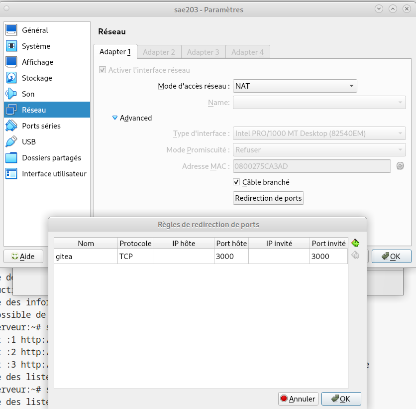
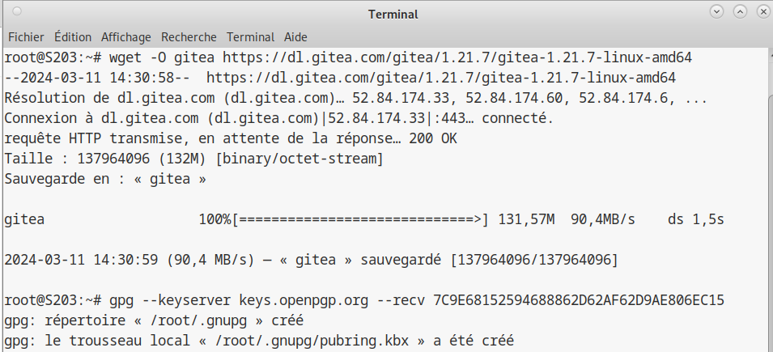

Dans ce rapport, nous allons voir comment créer une machine virtuelle sous Linux.

--- 

## Création de la machine virtuelle {#creation}
Pour commencer, nous allons nous rendre sur le logiciel **[Oracle VM Virtualbox](https://www.virtualbox.org/)**.

- Cliquez sur le bouton **Nouvelle** puis renseignez :
   - Le nom que vous souhaitez lui donner dans le champ ___Nom___.
   - Le chemin d’accès au dossier de la machine dans le champ ___Folder___
   - Sélectionnez **[Linux](https://www.linux.org/)** dans le champ ___Type___ puis sélectionnez **[Debian (64-bit)](https://www.debian.org/index.fr.html)** comme ci-dessous :

Cliquez sur le bouton **Suivant**
   


  
- Maintenant, ajustez la mémoire vive que vous souhaitez allouer à votre machine virtuelle ainsi que le nombre de Processeurs. On choisira ici 2048 MB de mémoire vive et un seul processeur.
   - Cliquez sur le bouton **Suivant**


   
- Ici nous allons décider de la taille du disque dur virtuel de la machine. On choisira ici 20,00 GB.
   - Cliquez sur le bouton **Suivant**


- Petit récapitulatif avant de confirmer la création de la machine virtuelle :
   - Si tout vous semble correct, cliquez sur le bouton **Finish**


- Avant de pouvoir démarrer notre machine virtuelle, nous devons lui donner un fichier en .iso afin d’installer le Système d’Exploitation appelé OS.

   - Pour cela, il faut cliquer sur le bouton **Configuration**, puis se rendre dans ‘Stockage’, puis en dessous de ‘Contrôleur : IDE’ sur ‘Vide’, puis sur le petit disque bleu comme l’image ci-dessous. Puis renseigner le chemin d’accès au fichier .iso installer préalablement.
   - Cliquez sur le bouton **OK**


--- 

1. Questions configuration matérielle dans VirtualBox :

• Que signifie “64-bit” dans “Debian 64-bit” ?

Dans « Debian 64 bits », le terme « 64 bits » fait référence à l'architecture de processeur sur laquelle la version Debian est conçue pour fonctionner. Les processeurs 64 bits sont capables de traiter des données et des instructions dans des blocs de 64 bits, ce qui leur permet de gérer de plus grandes quantités de mémoire et d'exécuter des logiciels optimisés pour l'architecture. Pour résumer, « Debian 64 bits » est une version de Debian conçue pour fonctionner sur des processeurs 64 bits.

 • Quelle est la configuration réseau utilisée par défaut ? 

La configuration réseau utilisée par défaut dans Debian dépend de plusieurs facteurs, notamment de la méthode d'installation et des paramètres réseau spécifiques de l'utilisateur. Normalement, lors de l'installation de Debian, le système tente de configurer automatiquement le réseau à l'aide de DHCP (Dynamic Host Configuration Protocol) pour obtenir une adresse IP d'un serveur DHCP sur le réseau local.

• Quel est le nom du fichier XML contenant la configuration de votre machine ? 

Le fichier se nomme '[nom de la machine virtuelle].vbox', dans ce cas 'sae203.vbox'.

• Sauriez-vous le modifier directement ce fichier de configuration pour mettre 2 processeurs à votre machine ? 

Oui, en ajoutant ```count="2"``` à l'intérieur de la balise <*CPU*>


--- 

## Premier démarrage de la machine {#firstdemarrage}

Désormais notre machine virtuelle est prête, nous pouvons la démarrer via le bouton **Démarrer**. Attendre que la machine démarre…

   - À l’aide des flèches directionnelles allez sur ‘Install’, puis faîtes __*Entrer*__ pour valider.


Maintenant, patientez…

   - À l’aide des flèches directionnelles allez sur la langue de votre choix, ici ‘Français’. Puis faîtes __*Entrer*__ pour valider.


   - Vous allez choisir ici la langue de la configuration de votre clavier, ici ‘Français’. Puis faîtes __*Entrer*__ pour valider.


   - Ici vous devez donner un nom à votre machin pour votre réseau. Nous l’appellerons ‘serveur’. Puis faîtes Entrer pour valider.


   - Sur la fenêtre suivante, laissez le champ vide et faîtes __*Entrer*__ pour valider.


--- 

## Gestion des utilisateurs de la machine {#users}

   - Nous allons ensuite configurer l’utilisateur administrateur ‘Root’ en lui donnant un mot de passe. Nous utiliserons ‘root’ comme mot de passe pour l’exemple. Faîtes __*Entrer*__ pour valider.


   - Une fois la configuration de l’utilisateur ‘Root’, nous allons créer un nouvel utilisateur cette fois sans permission sur notre machine virtuelle que l’on va nommer ‘User’. Faîtes __*Entrer*__ pour valider.


- Comme pour l’utilisateur ‘Root’, nous allons définir un mot de passe pour l’utilisateur ‘User’, ici on lui donnera ‘user’ comme mot de passe. Faîtes __*Entrer*__ pour valider.


- Sur cette fenêtre nous devons choisir la partition des disques. On va sélectionner ici ‘utiliser un disque entier’. Faîtes __*Entrer*__ pour valider.


- Ensuite sélectionnez ‘tout dans une seule partition’. Faîtes __*Entrer*__ pour valider.


- Ensuite, nous allons choisir l’outil de gestion des paquets de notre machine virtuelle. Nous allons choisir ici le Miroir de l’archive Debian ‘debien.polytech-lille.fr’. Faîtes __*Entrer*__ pour valider.


Maintenant, patientez…

--- 

## Installation de programmes supplémentaires {#prog}

- Nous devons maintenant sélectionner des logiciels supplémentaires à installer sur notre machine. Nous allons sélectionner ici (grâce à la touche ‘*ESPACE*’) :
  - environnement de bureau Debian,
  - MATE,
  - serveur web,
  - serveur SSH,
  - utilitaires usuels du système

Une fois effectué, faîtes __*Entrer*__ pour valider.


- Arrivé sur cette fenêtre, faîtes ENTRÉE pour finir l’installation de votre machine.


Maintenant, patientez le temps que l’installation se termine…

--- 

2. Questions installation OS de base :

|C'est quoi ?|Explication|
|:-----|:-----:|
|Un fichier iso bootable|C'est une image disque qui contient toutes les données d'un système de fichiers et est destinée à être utilisée comme support de démarrage|
|MATE et GNOME|MATE et GNOME sont deux environnements de bureau basés sur les systèmes d'exploitation Linux. Ils fournissent une interface utilisateur graphique (GUI) pour interagir avec le système d'exploitation.|
|Un serveur web|Un serveur Web est un logiciel conçu pour servir des pages Web sur Internet ou un réseau local.|
|Un serveur ssh|SSH, ou Secure Shell, est un protocole de communication sécurisé utilisé pour accéder à distance aux ordinateurs et exécuter des commandes en toute sécurité sur un réseau informatique.|
|Un serveur mandataire|Également appelé serveur proxy, est un serveur intermédiaire qui fait office d'intermédiaire entre les utilisateurs et les serveurs de terminaux.|
--- 

## Préparation du système {#prepsys}

Maintenant que notre machine virtuelle est correctement installée et configurée, nous allons y ajouter des suppléments.

Nous allons ajouter nos utilisateurs au groupe '**sudo**'.

Pour cela, nous allons ouvrir le terminal de commandes grâce au raccourcis **CTRL+ALT+F1**.

Puis exécutez les commandes ```adduser root sudo``` et ```adduser user sudo``` comme ci-dessous.


--- 

3. Question sudo :

- Comment peut-on savoir à quels groupes appartient l’utilisateur user ?

Il faut faire la commande ```group user``` dans le terminal en étant connecté avec l'utilisateur *root*.

--- 

Une fois les utilisateurs ajoutés au groupe **sudo**, nous allons ajouté les suppléments invités.

Pour cela, allez dans l'onglet '**Périphériques**','**Insérer l'image CD des Additions invité...**'


Puis exécutez les commandes
```sudo mount /dev/cdrom /mnt``` puis

```sudo /mnt/VBoxLinuxAdditions.run``` comme ci-dessous :


Voila c'est terminé, vous pouvez désormais utiliser correctement votre machine virtuelle !

--- 

4. Questions suppléments invités

- Quel est la version du noyau Linux utilisé par votre VM ?

Pour obtenir la version du noyau Linux utilisé par notre VM, il faut utiliser la commande ```uname -r``` dans le terminal de commandes.
La version de notre VM actuelle est **6.1.0-18-amd64**.

- À quoi servent les suppléments invités ? Donner 2 principales raisons de les installer. 
  - Meilleure intégration des systèmes hôtes et des machines virtuelles : les ajouts invités permettent souvent un partage de fichiers plus efficace entre les hôtes et les machines virtuelles, ainsi qu'une meilleure synchronisation de l'horloge, un ajustement automatique de la résolution d'écran, et bien plus encore. Cela facilite le travail entre les deux environnements et améliore l'expérience utilisateur.

  - Performances améliorées : certains modules complémentaires invités fournissent des pilotes spécifiques qui optimisent les performances de la machine virtuelle, comme l'amélioration des performances graphiques en utilisant des pilotes graphiques natifs, un accès plus rapide aux périphériques ou l'optimisation de la mémoire de gestion du serveur. Cela rend la machine virtuelle plus fluide et plus efficace.

- À quoi sert la commande mount (dans notre cas de figure et dans le cas général) ?

La commande mount est utilisée pour monter un système de fichiers dans l’arborescence des fichiers du système d’exploitation. Généralement, il est utilisé pour connecter des périphériques de stockage tels que des disques durs, des partitions, des clés USB, des partages réseau, etc. à des répertoires spécifiques dans l'arborescence des fichiers système. Il permet d'accéder aux données stockées sur ces appareils comme si elles faisaient partie du système de fichiers local. Dans notre scénario, dans un environnement virtualisé, la commande mount peut également être utilisée pour monter un partage de fichiers entre l'hôte et la machine virtuelle, ou pour monter une image de disque virtuel.

--- 

## A propos de la distribution Debian {#infosdebian}

- Qu’est-ce que le Projet Debian ? D’où vient le nom Debian ?

Le projet Debian est une initiative communautaire visant à développer un système d'exploitation libre et open source basé sur le noyau Linux. Le projet Debian a été fondé par Ian Murdock en 1993 pour créer une distribution Linux stable, flexible et gratuite. Le système d'exploitation est connu pour sa stabilité, sa large sélection de logiciels et son engagement envers les principes du logiciel libre.

Le nom “ Debian”  est une combinaison du nom du fondateur Ian Murdock et de celui de sa femme Debra. Donc  Debian  est une abréviation de  Debra et Ian . Le nom est également un clin d'œil à d'autres distributions Linux populaires de l'époque, telles que Slackware et SUSE , qui étaient toutes basées sur les noms de leurs créateurs.


- Il existe 3 durées de prise en charge (support) de ces versions : la durée minimale, la durée en
support long terme (LTS) et la durée en support long terme étendue (ELTS). Quelle sont les
durées de ces prises en charge ?

durée minimale : 3ans
LTS : environ 5ans
ELTS : ça dépend de la version.


- Pendant combien de temps les mises à jour de sécurité seront-elles fournies ?

Les mises à jour de sécurité pour les versions stables de Debian sont généralement disponibles pendant environ cinq ans après leur publication initiale. Cependant, la durée exacte peut varier en fonction des circonstances et des besoins de la communauté. Pour obtenir des détails spécifiques sur la version en cours d'utilisation, il est recommandé de consulter la documentation officielle de Debian.

- Combien de version au minimum sont activement maintenues par Debian ? Donnez leur nom
générique (= les types de distribution).

Debian maintient au minimum trois versions : 
Une version stable, la plus stable actuellement
Une version testing, la version en cours de développement
Une version unstable, la version la plus récente mais peut être moins stable

- Chaque distribution majeure possède un nom de code différent. Par exemple, la version majeur
actuelle (Debian 12) se nomme bookworm. D’où viennent les noms de code données aux distributions ?!

Les noms de code des distributions Debian sont généralement tirés de personnages de la trilogie de films Toy Story de Pixar, ajoutant une touche ludique à chaque version. Par exemple, la version majeure actuelle, Debian 12, est appelée "bookworm".


- L’un des atouts de Debian fut le nombre d’architecture (= processeurs) officiellement prises en
charge. Combien et lesquelles sont prises en charge par la version Bullseye ?


Debian Bullseye (version 11) prend en charge diverses architectures, dépassant souvent 10. Pour la liste actuelle, référez-vous à la documentation officielle. Les architectures couramment prises en charge incluent x86, ARM, MIPS, PowerPC, entre autres.


- Première version avec un nom de code :

  - Quelle a était le premier nom de code utilisé ?

  - Quand a-t-il été annoncé ?

  - Quelle était le numéro de version de cette distribution ?


 Première version avec un nom de code :

Le premier nom de code était "Buzz".
Annoncé le 17 août 1996.
La version associée était Debian 1.1 (Buzz).


- Dernière nom de code attribué
  - Quel est le dernier nom de code annoncée à ce jour ?

  Le dernier nom de code annoncé est '**bookworm**'.


  - Quand a-t-il été annoncé ?

  Le 10 février 2024.

  - Quelle est la version de cette distribution ?

   Bookworm est la version 12 de Debian.

--- 

## Installation préconfigurée {#automat}

Maintenant que nous avons appris à créer une machine virtuelle manuellement,

nous allons voir comment créer des machines virtuelles automatiquement.

Vous devez donc ouvrir un terminal de commandes, exécuter la commande

```cd <chemin vers votre dossier>``` puis celle-ci :


Attendez l'installation et vous pouvez démarrer votre nouvelle machine !

Une fois démarrée, ouvrez un terminale de commandes dans votre machine virtuelle, puis exécutez les commandes suivantes :

```apt install sudo```,

```apt install git```,

```apt install sqlite3```,

```apt install curl```,

```apt install bash-completion```,

```apt install neofetch```

Comme l'image ci-dessous :


Voilà, votre installation est maintenant personnalisée et prête !

--- 

Pour continuer, nous allons paramétrer le logiciel git sur le compte utilisateur.
Pour cela, nous allons ouvrir un **invite de commande** et exécuter les commandes suivantes :
```git config --global user.name "Prenom Nom"```
```git config --global user.email "Votre adresse email"```
```git config --global init.defaultBranch "master"```

Comme ci-dessous :


Une fois cette étape terminée, nous allons installer une interface graphique pour une utilisation plus simple de Git.

Pour cela, nous devons d'abord installer Gitk et Git-gui,
Via les commandes ```apt install gitk``` ```apt install git-gui```.


 - Qu’est-ce que le logiciel gitk ? Comment se lance-t-il ?

Gitk est un outil open-source pour visualiser l'historique d'un dépôt Git. Il offre une interface intuitive pour explorer les commits, branches, tags et diffs, facilitant la compréhension du projet.
On le lance, en lançant un terminal et marquer la commande gitk.

- Qu’est-ce que le logiciel git-gui ? Comment se lance-t-il ?

Git-gui est un logiciel libre et open-source qui fournit une interface graphique pour les opérations Git courantes. Il permet aux utilisateurs de visualiser et de modifier l'historique d'un dépôt Git, de créer et de fusionner des branches, et de gérer les commits et les fichiers.


---

Ensuite, parmis une large liste d'interface graphique diponible gratuitement ou payantes, j'ai choisis d'installer Sublime-merge
car c'est une extension du logiciel Sublime Texte que j'utilise régulièrement. Libre à vous de faire votre choix !

Nous l’avons installé via l’invite de commande grâces aux commandes suivantes :

Instalation de la clé GPG de Sublime merge via la commande
```wget -qO -https://download.sublimetext.com/sublimehq-pub.gpg | gpg --dearmor | sudo tee /etc/apt/trusted.gpg.d/sublimehq-archive.gpg > /dev/null```


La commande suivante : ```sudo apt-get update```
Permet d'enregistrer la clé GPG.


Quand l'enregistrement est terminé, nous pouvons installer **Sublime merge** via la commande :
```sudo apt-get install sublime-merge```.


---

Nous allons désormais installer Gitea qui est un service web et utilise par défaut le port 3000 de la machine sur lequel il est démarré. Donc s’il faut être root pour installer le service, ce n’est pas obligatoire pour son utilisation.

Pour cela, allez dans la configuration de votre _machine virtuelle_ via la bouton **Configuration** (engrenage orange)




 - Qu’est-ce que Gitea ?
Gitea est un logiciel libre que vous pouvez installer sur votre propre serveur pour héberger un service de gestion de version similaire à GitHub, GitLab ou Bitbucket.
En d'autres termes, c'est un hébergeur Git auto-hébergé.

 - À quels logiciels bien connus dans ce domaine peut-on le comparer (en citer au moins 2) ?
On peut le comparer a **Github** et **Gitlab**. 

---


Pour l'installer, nous allons le faire par le biais d'un binaire précompilé à l'aide de la commande suivante.



Une fois l'installation du binaire précompilé, on ajoute un utilisateur administrateur :


---

 - Quelle version du binaire avez-vous installée ? Donnez la version et la commande permettant
d’obtenir cette information.

La version installée est la 1.21.9
On retrouve cette information avec la commande : ```gitea --version```

 - Comment faire pour mettre à jour le binaire de votre service sans devoir tout reconfigurer ?
Essayez en mettant à jour vers la version 1.22-dev.

Pour cela, il faut arrêtez le service gitea via la commande ```systemctl stop gitea```

Installer la nouvelle version souhaitée (**1.22-dev**).

Puis exécuter la commande ```systemctl start gitea``` pour redémarrer le service gitea.

---

Puis je créé la structure de dossier requise :


Et voila, vous avez désormais terminé de préparer votre machine virtuelle !

Merci d'avoir suivis ce rapport.